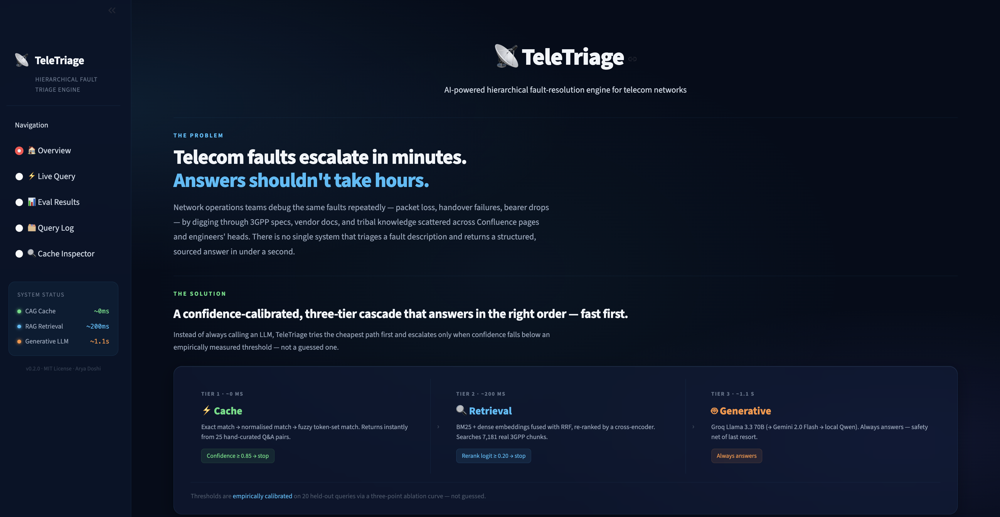
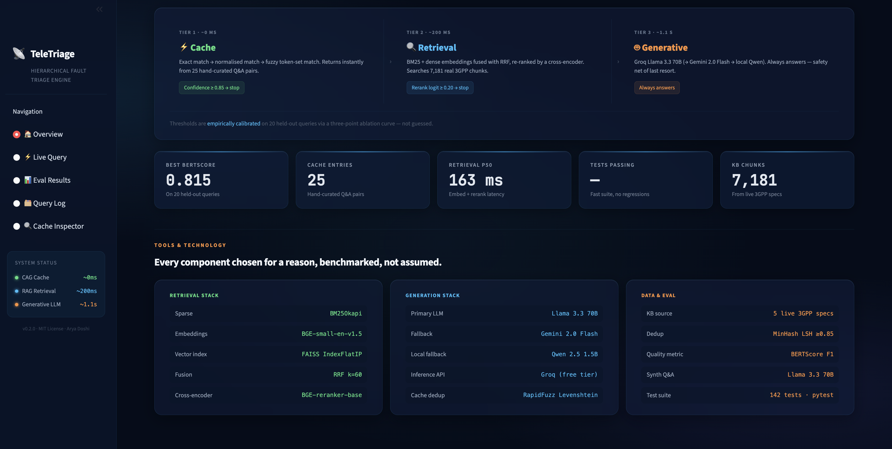
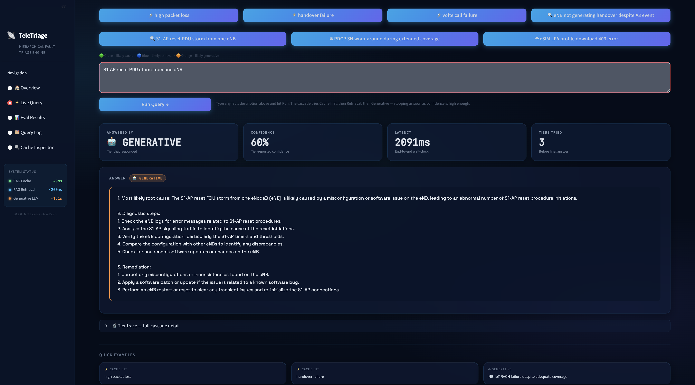
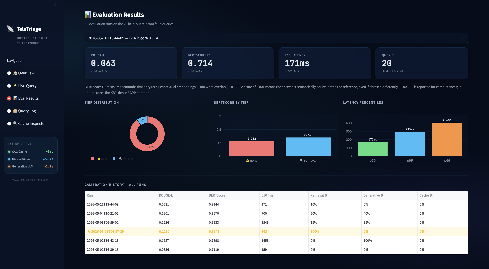
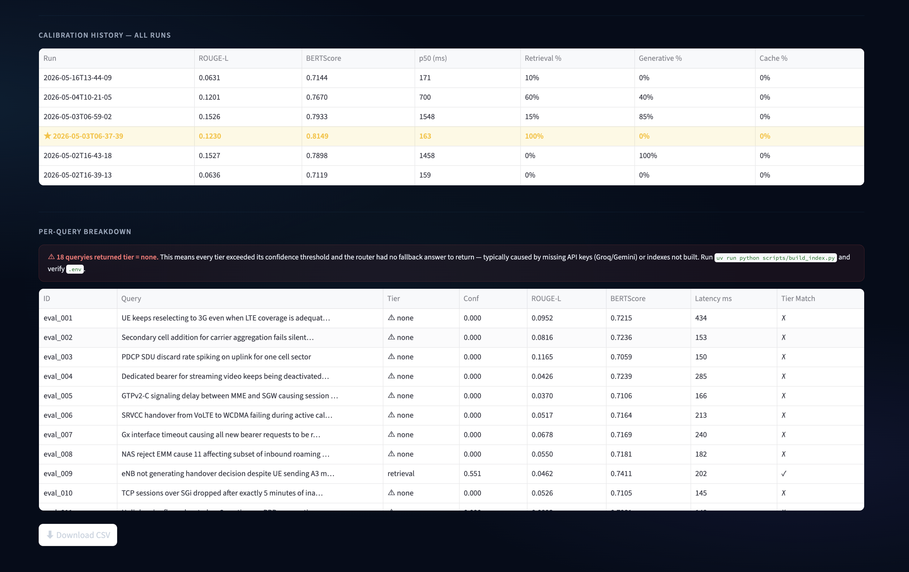
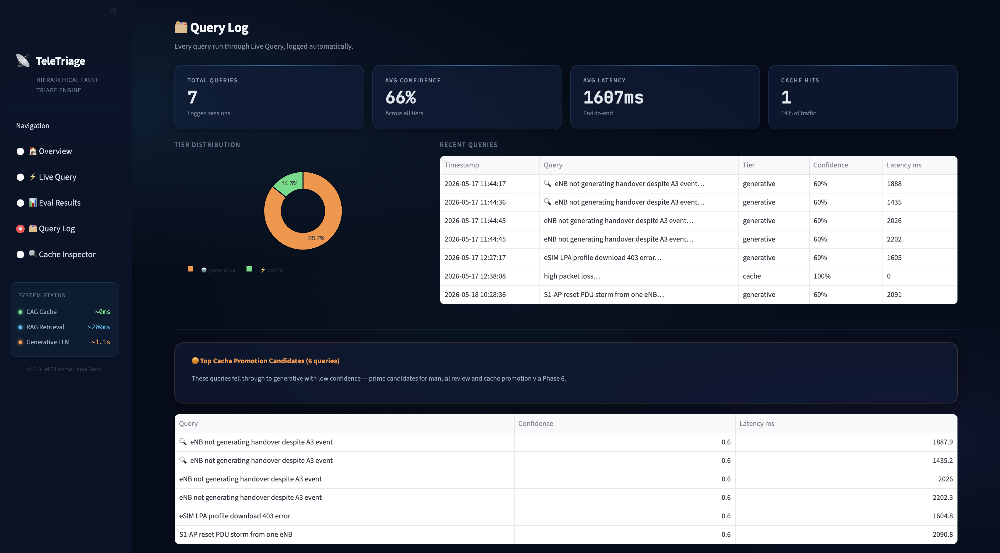
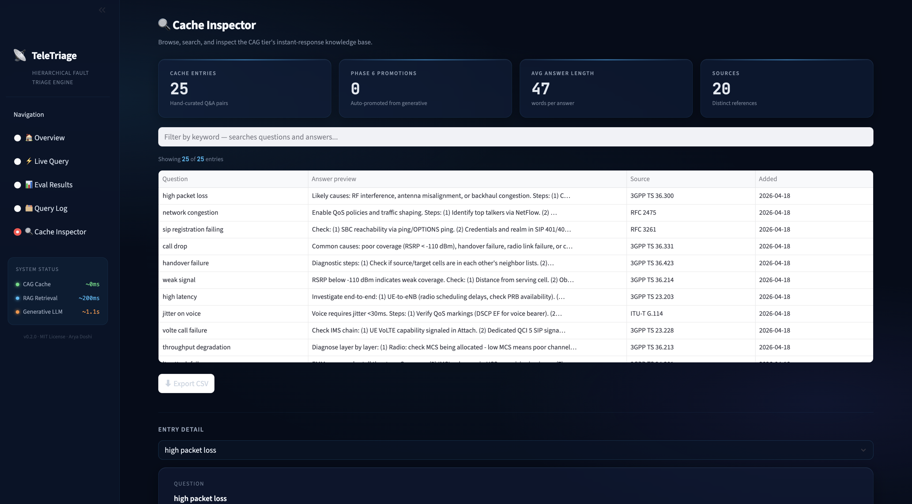

<div align="center">

# 📡 TeleTriage

### Telecom faults escalate in minutes. Answers shouldn't take hours.
**A hierarchical multi-tier fault-resolution engine: cache for known repeats, grounded RAG synthesis with spec citations for anything the corpus covers, and a closed-book LLM fallback for everything else — stopping at the cheapest path that meets confidence.**

<br>

[](https://python.org)
[](https://pytorch.org)
[](https://github.com/facebookresearch/faiss)
[](https://console.groq.com)
[](https://streamlit.io)
[](tests/)
[](LICENSE)

> A **3-tier confidence-calibrated cascade** — Cache-Augmented Generation → grounded RAG synthesis (BM25 + dense + cross-encoder rerank, then an LLM constrained to answer only from the retrieved excerpts, citing spec sources per claim) → closed-book Groq Llama 3.3 70B fallback — built on 6,913 real 3GPP specification chunks, evaluated on 20 held-out queries with empirically measured thresholds.

</div>

---

## What It Does

TeleTriage takes any telecom fault description and routes it through a three-tier cascade that always tries the cheapest, fastest path first:

- **Caches** — exact match → normalised match → fuzzy token-set match. Returns in under 1ms from 25 hand-curated Q&A pairs.
- **Retrieves and synthesizes** — BM25 sparse search fused with BGE-small dense embeddings via Reciprocal Rank Fusion, re-ranked by a bge-reranker-base cross-encoder, over 6,913 real 3GPP specification chunks. The top-ranked excerpts are then passed to an LLM that's constrained to answer **only** from that retrieved context — it cites the source specification inline for every claim, and if the excerpts only partially cover the question (or don't cover it at all), it says so explicitly instead of guessing. This is genuine grounded RAG, not extractive lookup: the answer is generated, but every claim in it traces back to a specific retrieved passage.
- **Generates (closed-book)** — Groq Llama 3.3 70B as primary, Gemini as backup, local Qwen 2.5-1.5B as offline last resort. No retrieved context to ground it — this tier exists for questions the corpus doesn't cover, and it always answers rather than failing outright.
- **Calibrates** — thresholds set by measurement, not guessing. `min_rerank_score` (which excerpts are trusted enough to synthesize from) was set via a three-point ablation curve on 20 held-out queries — see below for what's actually measured vs. reasoned defaults.
- **Evaluates** — ROUGE-L and BERTScore F1, latency percentiles (p50/p95/p99), per-tier quality breakdown, all logged and visualised in a live dashboard.

TeleTriage is designed for telecom operations teams that need structured, sourced answers faster than a manual spec lookup.

---

## ✨ Features

### Core Architecture
- **3-tier cascade** — CAG → grounded RAG synthesis → closed-book Generative, each tier delegating only when confidence falls below its calibrated threshold
- **Confidence-based routing** — CAG stops at ≥ 0.85, RAG synthesis gates on rerank logit ≥ 0.20 (before spending an LLM call), generative always answers
- **Empirically calibrated thresholds** — `min_rerank_score` set via a three-point ablation curve on 20 held-out queries; the two cache thresholds are reasoned defaults, not yet ablated (see [Design Notes](#design-notes))
- **Full tier trace** — every query logs which tier answered, confidence, latency, and delegation reason

### Retrieval + RAG Synthesis
- **Hybrid search** — BM25 (lexical) + BGE-small-en-v1.5 (dense) fused with Reciprocal Rank Fusion (k=60, Cormack et al. 2009)
- **Cross-encoder reranking** — bge-reranker-base scores query-document pairs jointly; sigmoid(logit) → calibrated confidence gate, checked *before* any LLM call
- **Grounded synthesis, not extraction** — the top reranked excerpts are handed to an LLM constrained to answer only from them; it cites the source spec inline per claim and states explicitly when the excerpts don't (fully) cover the question, instead of guessing
- **BGE asymmetric prefix** — query prefix applied correctly; corpus documents encoded without prefix (as the model was trained)
- **6,913 real 3GPP chunks** — scraped from TS 36.300, 36.331, 36.413, 24.301, 23.401; MinHash LSH dedup (Jaccard ≥ 0.85), with the deduplication rebuild bug fixed (see [Data Pipeline](#data-pipeline)) — this figure is verified duplicate-free

### Generation Stack
- **Groq Llama 3.3 70B** — primary backend for both RAG synthesis and closed-book fallback, ~500 tok/s, free tier
- **Independent Groq keys per tier** — RAG synthesis and the closed-book fallback each hold their own Groq API key, drawing from separate rate-limit pools instead of competing for one — see [Multi-Provider Rate Limits](#multi-provider-rate-limits)
- **Gemini** (`gemini-flash-latest`) — automatic fallback on Groq rate limit or failure
- **Qwen 2.5-1.5B-Instruct** — local last-resort fallback, runs in an isolated subprocess (not in-process — see below), no API key required
- **Exponential backoff** — 3 attempts per backend, waiting 1s then 2s between them; the final attempt doesn't sleep before giving up, no jitter, no explicit time cap

### Adaptive Cache (Phase 6)
- **3-gate quality filter** — confidence ≥ 0.60, answer length ≥ 50 words, Levenshtein dedup before any promotion
- **Batch promotion CLI** — `scripts/promote_cache.py` with `--dry-run`, rich table output, JSON report
- **Live injection** — promoted entries immediately available without restart

### Observability Dashboard
- **Glassmorphism dark UI** — five views: Overview, Live Query, Eval Results, Query Log, Cache Inspector
- **Calibration history** — all eval runs in one table, best run highlighted, per-run BERTScore + latency charts
- **Query logging** — every Live Query run appended to `outputs/query_metrics.jsonl`; top promotion candidates surfaced automatically
- **CSV export** — per-query breakdown and cache entries exportable directly from the dashboard

---

## 📸 Screenshots

### 🏠 Overview — Architecture & Introduction


---

### 📊 Overview — Tech Stack & Stats


---

### ⚡ Live Query — Running the Cascade


---

### 🔬 Tier Trace — Full Cascade Detail


---

### 📊 Evaluation Results — Calibration History & Per-Tier Charts


---

### 📋 Per-Query Breakdown


---

### 🗂️ Query Log — Usage Tracking & Promotion Candidates


---

### 🔍 Cache Inspector — Browse, Search & Inspect


---

## 📊 Evaluation Results

Evaluated on **20 held-out telecom fault queries** — none appeared in the cache or knowledge base during development.

### Current Results — real corpus, RAG synthesis tier 2

Measured against the current, verified-duplicate-free 6,913-chunk real 3GPP corpus, with tier 2 performing grounded RAG synthesis (not the old extractive lookup below). Source: `outputs/eval_current_6913.json` (gitignored local eval output, not committed — regenerate with `uv run python scripts/run_eval.py --pacing-sec 3`), run 2026-08-13, against indexes built the same day from this exact corpus — corpus, index, and eval all agree.

| Tier | Queries | Share | BERTScore F1 | p50 Latency |
|------|---------|-------|---------------|-------------|
| Cache | 0 | 0% | — | — |
| RAG synthesis (retrieval) | 12 | 60% | 0.766 | 2317ms |
| Generative (closed-book) | 8 | 40% | 0.783 | 1800ms |
| None (unanswered) | 0 | 0% | — | — |

Overall: ROUGE-L mean 0.131, BERTScore F1 mean 0.773. End-to-end latency: p50 2171ms, p95 2720ms, p99 4202ms, mean 2215ms. Backend distribution: 19/20 (95%) answered by Groq directly, 1/20 (5%) fell back to Gemini on a rate-limited tier 2 call. **Zero `tier=none` failures** — every one of the 20 queries got an answer from cache, RAG synthesis, or the closed-book fallback.

**The 60/40 retrieval/generative split is the single strongest before/after in this project.** The historical calibration curve below — run against a 30-document sample KB — found the corpus covered only 15% of held-out queries at the calibrated threshold. Against the real, ~6,900-chunk corpus, retrieval now covers 60%. The corpus size was the bottleneck the whole time, not the confidence threshold.

### Historical calibration curve (superseded — 30-doc sample KB, extractive tier 2)

⚠️ **Scope note:** this ablation predates the RAG synthesis rewrite and the real corpus. It ran against a 30-document sample knowledge base, and tier 2 at the time returned a matched KB entry *verbatim* rather than synthesizing an answer. It's kept here because `min_rerank_score = 0.20` — the confidence gate a query must clear before tier 2 will even attempt an answer — is still calibrated from this data; that gating logic didn't change in the rewrite, only what happens after a query passes it. See "Current Results" above for the real-corpus, RAG-synthesis numbers.

| Config | Threshold | Retrieval | Generative | ROUGE-L | BERTScore F1 | p50 Latency |
|--------|-----------|-----------|------------|---------|--------------|-------------|
| Strict | logit ≥ 0.50 | 0% | 100% | 0.153 | 0.790 | 1458ms |
| **Calibrated** *(production)* | **logit ≥ 0.20** | **15%** | **85%** | **0.153** | **0.793** | **1548ms** |
| Relaxed | logit ≥ 0.00 | 100% | 0% | 0.123 | 0.815 | 163ms |

**Key findings from this historical ablation:**

**BERTScore favours retrieval over generation (+0.025).** KB contains verified 3GPP procedures; Groq paraphrases the same knowledge less precisely. Retrieval at logit ≥ 0.20 scores BERTScore 0.804–0.842 vs generative mean 0.787.

**ROUGE-L is the wrong primary metric here.** The KB uses dense structured notation (3GPP TS references, EMM cause codes, interface names) that diverges lexically from plain-English reference answers. BERTScore captures semantic correctness; ROUGE measures word overlap. Both are reported for transparency.

**The reranker correctly signals no-coverage.** 17 of 20 eval queries score logit 0.003–0.010 — near-noise. Their retrieval BERTScore (0.786–0.799) sits at or below the generative mean, confirming the reranker is right to delegate.

**Latency percentiles from this historical ablation (generative tier, n=17, 30-doc sample KB):**

| p50 | p95 | p99 |
|-----|-----|-----|
| 1458ms | 1734ms | 1775ms |

These numbers predate tier 2 making an LLM call at all — they're not comparable to current tier 2 latency. See "Current Results" above and the cascade diagram below for present-day figures.

---

## 🏗️ How the Cascade Works

```
Incoming fault description
        │
        ▼
┌─────────────────────────────────────────────┐
│  Tier 1 — CAG Cache                ~0–1ms   │
│  exact → normalised → fuzzy match           │
│  confidence ≥ 0.85 → answer returned        │
└──────────────────────┬──────────────────────┘
                       │ miss
                       ▼
┌─────────────────────────────────────────────┐
│  Tier 2 — RAG Synthesis       ~2000-2500ms  │
│  BM25 (top-20) ──┐                          │
│                  ├── RRF k=60               │
│  BGE dense (top-20)                         │
│                  └── cross-encoder rerank   │
│  rerank logit ≥ 0.20 → LLM synthesizes      │
│  ONLY from retrieved excerpts, cites        │
│  source spec per claim (or says so if       │
│  the excerpts don't cover the question)     │
└──────────────────────┬──────────────────────┘
                       │ miss
                       ▼
┌─────────────────────────────────────────────┐
│  Tier 3 — Generative          ~1800-2200ms  │
│  Closed-book — no retrieved context         │
│  Groq Llama 3.3 70B (own key, own           │
│  12K TPM pool, separate from tier 2)        │
│    → Gemini (if rate-limited)               │
│      → local Qwen 2.5-1.5B (if offline,     │
│        isolated subprocess)                 │
│  Always answers — safety net of last resort │
└──────────────────────┬──────────────────────┘
                       │
                       ▼
     Response(answer, tier, confidence,
              latency_sec, tier_trace)
```

**On tier 2's latency:** it's driven primarily by how much the model *generates*, not by how much retrieved context it's given. An isolated test of the synthesis call alone (same production prompt and token budget, `outputs/synthesis_latency.json` — gitignored local output, regenerate with `uv run python scripts/eval_synthesis_latency.py`) measured clean Groq calls completing in as little as 724–1020ms — and, notably, the largest-context configuration tested was the *fastest* single reading, ruling out context size as the bottleneck. The full ~2000–2500ms end-to-end figure above (retrieval + reranking + synthesis, measured in the current production-representative eval) reflects that tier 2 is designed to produce a structured, multi-section, cited answer — root cause, up to 5 diagnostic steps, up to 3 remediation steps, each grounded in a spec — which takes Groq proportionally longer to generate token-by-token than a short reply would.

---

# The full flow in one picture 
User types a query
        │
        ▼
backend/cli.py  OR  scripts/run_query.py  OR  frontend/dashboard.py
        │
        ▼
backend/router.py  →  Router.route(query)
        │
        ├──▶ backend/tiers/cache_tier.py
        │         reads: database/sample_cache.json
        │         uses:  rapidfuzz
        │         returns TierResult (confidence 0.85–1.0 if hit, 0.0 if miss)
        │
        ├──▶ backend/tiers/retrieval_tier.py
        │         uses:  backend/retrieval/bm25.py
        │                backend/retrieval/dense.py  ←  backend/retrieval/embedder.py
        │                backend/retrieval/hybrid.py
        │                backend/retrieval/reranker.py
        │         reads: database/indexes/bm25.pkl
        │                database/indexes/faiss.index + faiss_docs.json
        │         if rerank logit ≥ gate: backend/generation/llm_client.py
        │                (GroqClient, tier 2's OWN key → GeminiClient →
        │                 LocalQwenClient) synthesizes an answer from ONLY
        │                the reranked excerpts, citing sources per claim
        │         returns TierResult (confidence from sigmoid(logit), or 0.0 if below gate)
        │
        └──▶ backend/tiers/generative_tier.py
                  uses:  backend/generation/llm_client.py
                         (GroqClient, tier 3's OWN key → GeminiClient →
                          LocalQwenClient) — closed-book, no retrieved context
                  returns TierResult (hardcoded confidence 0.60, always answered=True)
        │
        ▼
Response(answer, answered_by, confidence, total_latency, tier_trace)
        │
        ▼
Printed to terminal / shown in dashboard

---

## 🧱 Component Reference

| # | Component | Technology | Role |
|---|-----------|-----------|------|
| 1 | Cache tier | `rapidfuzz` token-set ratio | Exact → normalised → fuzzy match; confidence scales with similarity |
| 2 | Embedder | `BAAI/bge-small-en-v1.5` 384-dim | Bi-encoder with asymmetric query prefix; L2-norm → inner product = cosine |
| 3 | Sparse retriever | `rank_bm25` BM25Okapi | Lexical baseline; catches exact 3GPP identifiers dense search misses |
| 4 | Dense retriever | `faiss-cpu` IndexFlatIP | Exact cosine search over pre-encoded corpus |
| 5 | Hybrid fusion | Reciprocal Rank Fusion k=60 | score(d) = Σ 1/(60 + rank_i); score-free, no normalisation needed |
| 6 | Reranker | `BAAI/bge-reranker-base` | Cross-encoder joint attention; sigmoid(logit) → confidence gate |
| 7 | RAG synthesis | Groq — Llama 3.3 70B, tier 2's own key | LLM constrained to answer ONLY from reranked excerpts; cites source spec per claim |
| 8 | Generation primary | Groq — Llama 3.3 70B, tier 3's own key | Closed-book fallback; ~500 tok/s, free tier, exponential backoff — separate 12K TPM pool from row 7 |
| 9 | Generation backup | Gemini (`gemini-flash-latest`) | Auto-fallback on Groq rate limit or failure, for both tier 2 and tier 3 |
| 10 | Generation offline | `Qwen2.5-1.5B-Instruct` | Last-resort fallback, isolated subprocess (not in-process — avoids a real SIGSEGV from coexisting with the embedder/reranker), no API key required |
| 11 | Cascade router | `backend.router.Router` | Orchestrates tiers, accumulates trace, logs every query |
| 12 | Cache promoter | `CachePromoter` + `rapidfuzz` | 3-gate filter before promotion (confidence, length, Levenshtein dedup) |
| 13 | Evaluator | `rouge-score` + `bert-score` | Per-tier and end-to-end metrics; subprocess-isolated BERTScore |
| 14 | Dashboard | Streamlit + Plotly | Glassmorphism dark UI; 5 views; auto-logs every Live Query run |

---

## What Makes This Different

| Feature | TeleTriage | Pure LLM Approach |
|---------|-----------|-------------------|
| Latency for known queries | ✅ ~0ms (cache hit) | ❌ ~1–2s always |
| Cost for repeated queries | ✅ Zero — static cache | ❌ Full LLM inference every time |
| Answer provenance | ✅ Source-cited (3GPP TS, RFC) | ❌ LLM may hallucinate citations |
| Calibrated thresholds | ⚠️ One of three measured (`min_rerank_score`, 20 held-out queries) — cache thresholds are reasoned defaults, pending ablation | ❌ Arbitrary or none |
| Evaluation methodology | ✅ ROUGE-L + BERTScore + latency percentiles | ❌ Vibes-based |
| Retrieval precision | ✅ Cross-encoder reranking over BM25+dense | ❌ Embedding similarity only |
| Knowledge base | ✅ 6,913 real 3GPP spec chunks | ❌ Frozen training data |
| Novel query coverage | ✅ Generative fallback always answers | ✅ Always answers |
| Test coverage | ✅ 247 fast / 280 total tests, 0 regressions | ❌ Typically none |

---

## 🛠️ Tech Stack

| Layer | Technology |
|-------|-----------|
| Embeddings | `BAAI/bge-small-en-v1.5` — 384-dim, ~30M params, CPU-friendly |
| Sparse retrieval | `rank_bm25` BM25Okapi |
| Vector index | `faiss-cpu` IndexFlatIP — exact cosine search |
| Hybrid fusion | Reciprocal Rank Fusion (k=60) |
| Reranker | `BAAI/bge-reranker-base` cross-encoder |
| RAG synthesis | Groq API — Llama 3.3 70B (free tier, tier 2's own key) |
| Generation (primary) | Groq API — Llama 3.3 70B (free tier, tier 3's own key — separate pool from RAG synthesis) |
| Generation (backup) | Google Gemini (`gemini-flash-latest`, free tier via AI Studio) |
| Generation (offline) | `Qwen2.5-1.5B-Instruct` — local, isolated subprocess, no API required |
| Config system | Pydantic-settings + YAML + `.env` |
| Evaluation | `rouge-score`, `bert-score`, `psutil` |
| Dashboard | Streamlit + Plotly |
| Data pipeline | MinHash LSH dedup, recursive chunking, Groq-based synth QA |
| Testing | pytest — 247 fast / 280 total tests, fast suite < 5s |
| Package management | `uv` |

---

## 🚀 Quick Start

### Prerequisites

- Python 3.10+
- [`uv`](https://astral.sh/uv) — install with `curl -LsSf https://astral.sh/uv/install.sh | sh`
- API keys (both free, no credit card required):

| Service | Where to get it |
|---------|----------------|
| Groq | [console.groq.com](https://console.groq.com) → Create API Key |
| Google AI Studio | [aistudio.google.com](https://aistudio.google.com/app/apikey) → Get API Key |

### 1. Clone & Install

```bash
git clone https://github.com/aryadoshii/TeleTriage.git
cd TeleTriage
uv sync
```

### 2. Configure API Keys

```bash
cp .env.example .env
```

Edit `.env`:

```env
# Groq — used by tier 2's RAG synthesis (30 req/min on Llama 3.3 70B, free)
GROQ_API_KEY=gsk_...

# Optional: a SECOND Groq key, used ONLY by tier 3's closed-book fallback.
# Gives tier 2 and tier 3 independent rate-limit pools instead of one
# shared budget — see "Multi-Provider Rate Limits" below. If left blank,
# tier 3 falls back to GROQ_API_KEY above (works fine, just no isolation).
GROQ_API_KEY_TIER3=gsk_...

# Google AI Studio — fallback-of-last-resort for both tiers (free tier)
GOOGLE_API_KEY=...
```

### 3. Build Retrieval Indexes

```bash
# Downloads BGE-small (~30MB) on first run. ~2 min for 6,913 docs.
uv run python scripts/build_index.py
```

### 4. Run the System

```bash
# Cache hit — instant response
uv run teletriage query "high packet loss" --verbose

# Retrieval query
uv run teletriage query "eNB not generating handover despite A3 event"

# Novel query — generative fallback
uv run teletriage query "PDCP SN wrap-around during extended coverage"

# Launch the dashboard
uv run streamlit run frontend/dashboard.py --server.port 8501

# Run the evaluation harness
uv run python scripts/run_eval.py
```

---

## 📁 Project Layout

```
TeleTriage/
├── frontend/
│   ├── assets/                      # Screenshots and static assets
│   └── dashboard.py                 # Streamlit observability dashboard
│
├── backend/
│   ├── cli.py                       # `teletriage` installed entrypoint (query / info)
│   ├── config.py                    # Pydantic settings — YAML + .env
│   ├── types.py                     # Query, TierResult, Response
│   ├── router.py                    # Cascade orchestrator + query logging
│   │
│   ├── tiers/
│   │   ├── base.py                  # Abstract BaseTier
│   │   ├── cache_tier.py            # CAG: exact + normalised + fuzzy match
│   │   ├── retrieval_tier.py        # BM25 + dense + RRF + rerank, then RAG
│   │   │                            #   synthesis (own Groq key) if the gate passes
│   │   └── generative_tier.py       # Closed-book fallback (own Groq key) →
│   │                                #   Gemini → local Qwen
│   │
│   ├── retrieval/
│   │   ├── _types.py                # Hit dataclass
│   │   ├── embedder.py              # BGE-small with asymmetric query prefix
│   │   ├── bm25.py                  # BM25Okapi (build / save / load / search)
│   │   ├── dense.py                 # FAISS IndexFlatIP (build / save / load / search)
│   │   ├── hybrid.py                # Reciprocal Rank Fusion
│   │   └── reranker.py              # bge-reranker-base cross-encoder
│   │
│   ├── generation/
│   │   └── llm_client.py            # Protocol + GroqClient + GeminiClient +
│   │                                #   LocalQwenClient (isolated subprocess)
│   │
│   ├── cache/
│   │   └── promoter.py              # CachePromoter — 3-gate quality filter
│   │
│   ├── evaluation/
│   │   ├── metrics.py               # ROUGE-L, BERTScore, latency percentiles
│   │   ├── retrieval_metrics.py     # recall@k, MRR for the retrieval-only harness
│   │   ├── relevance.py             # Relevance-judgment helpers for eval_retrieval.py
│   │   ├── test_set.py              # 20 held-out eval queries with reference answers
│   │   └── evaluator.py             # Per-tier and end-to-end reporting
│   │
│   └── observability/
│       └── logger.py                # structlog setup
│
├── config/
│   └── config.yaml                  # Tier thresholds, model names (calibrated)
│
├── database/
│   ├── sample_cache.json            # CAG: 25 hand-curated telecom Q&A pairs
│   ├── sample_kb.jsonl              # RAG KB: 30 seed entries (used in tests)
│   ├── real_kb.jsonl                # ACTIVE corpus: 6,913 real 3GPP chunks
│   │                                #   (gitignored — see Data Pipeline below)
│   └── indexes/                     # Built by scripts/build_index.py (gitignored)
│
├── scripts/
│   ├── run_query.py                 # Single query CLI demo
│   ├── build_index.py               # Build BM25 + FAISS indexes
│   ├── scrape_data.py               # Scrape 3GPP specs → chunk → dedup
│   ├── synth_qa.py                  # Groq/Gemini synthetic Q&A generation
│   ├── promote_cache.py             # Batch cache promotion CLI
│   └── run_eval.py                  # Run full evaluation harness (--pacing-sec for Groq)
│
├── tests/                           # 247 fast / 280 total — uv run pytest -m "not slow and not integration"
│   ├── test_cache_tier.py           # 13 tests
│   ├── test_cache_promoter.py       # 27 tests
│   ├── test_generative_tier.py      # 62 tests (60 fast, 2 @integration)
│   ├── test_metrics.py              # 38 tests
│   ├── test_retrieval_metrics.py    # 27 tests
│   ├── test_retrieval_tier.py       # 100 tests (69 fast, 31 @slow/@integration)
│   └── test_synth_qa_resume.py      # 13 tests
│
├── outputs/                         # Eval reports + query metrics (gitignored)
├── pyproject.toml
├── .env.example
└── ROADMAP.md
```

---

## Running Tests

```bash
# Fast suite only — no model loading, 247 tests, < 5 seconds
uv run pytest -m "not slow and not integration"

# Full suite including model-loading tests (~several minutes)
uv run pytest -m "not integration"

# Integration tests — requires GROQ_API_KEY in .env
uv run pytest -m integration -v

# All 280 tests
uv run pytest
```

---

## Data Pipeline

The knowledge base was built from public 3GPP specifications:

```bash
# 1. Scrape and chunk 5 3GPP specs (~9MB prose, ~2 min)
uv run python scripts/scrape_data.py

# 2. Generate synthetic Q&A pairs via Groq (~7 min at 28 req/min)
uv run python scripts/synth_qa.py

# 3. Build retrieval indexes from the knowledge base
uv run python scripts/build_index.py --kb database/real_kb.jsonl

# 4. (Optional) Promote validated Q&A pairs into the cache
uv run python scripts/promote_cache.py --dry-run
uv run python scripts/promote_cache.py
```

**Corpus stats (5 specs, public 3GPP FTP) — verified against `database/real_kb.jsonl` directly:**

| Spec | Indexed Chunks | Indexed Chars |
|------|----------------|---------------|
| TS 36.300 — E-UTRA Architecture | 605 | 975,471 |
| TS 36.331 — RRC | 2,053 | 2,540,601 |
| TS 36.413 — S1-AP | 488 | 842,531 |
| TS 24.301 — NAS/EPS | 2,047 | 1,761,088 |
| TS 23.401 — GPRS/EPC | 1,720 | 1,467,569 |
| **Total** | **6,913** | **7,587,260** |

"Indexed" = what's actually in `real_kb.jsonl` after chunking, filtering, and deduplication — verified by parsing the file directly (`spec_id` + `char_count` per chunk), not taken from a script's printed summary.

**Deduplication math:** `scrape_data.py` reports "Before dedup: 7,156 → After dedup: 6,913 (−243, 3.4% dropped)", and the arithmetic now holds — 7,156 − 243 = 6,913 exactly. It didn't always: an earlier build of this exact corpus reported the same "243 dropped" but a final count of 7,055, a real bug in the dedup rebuild step (it matched kept chunks back to source objects by Python identity, silently re-including 142 exact-duplicate chunks MinHash had already flagged for removal). Caught by the arithmetic simply not reconciling, not glossed over — `deduplicate()` now returns kept *indices* into the original chunk list instead of kept text, which makes that class of bug structurally impossible rather than patched around. `real_kb.jsonl` is independently verified duplicate-free: 6,913 total docs, 6,913 unique texts, 0 remaining duplicate-value groups.

**3GPP revises these specs continuously.** This corpus has gone through three different chunk counts this project, for two distinct reasons: 7,236 → 7,055 reflects a real re-scrape after this project's own front-matter/references/boilerplate filters were tightened; 7,055 → 6,913 was the deduplication bug fix above, not a new scrape or a spec revision. Re-running `scripts/scrape_data.py` today may still fetch newer spec revisions from 3GPP and change the count again, independent of anything on this project's side.

---

## Design Notes

### Why three tiers?

Most production telecom faults are repetitive. The Pareto principle holds hard — roughly 60% of queries are the same handful of known issues. Paying LLM inference cost for every query is wasteful when an O(1) cache lookup exists for it. The tier hierarchy routes cheap queries to cheap answers and reserves the expensive path for genuinely novel problems.

### Why hybrid retrieval?

Dense-only retrieval misses exact term matches for rare telecom identifiers (`QCI 1`, `S1-AP`, `GUMMEI`, `EMM cause 11`). BM25 catches these; dense embeddings catch paraphrases. RRF fuses both without score normalisation — no calibration needed at the fusion step. The cross-encoder reranker then scores the top candidates with full query-document attention, the standard production pattern (Nogueira & Cho, 2019).

### Why BERTScore over ROUGE?

ROUGE measures lexical overlap. The 3GPP knowledge base uses dense structured notation (cause codes, interface names, 3GPP TS references) that diverges lexically from any plain-English reference answer. BERTScore uses contextual embeddings and measures semantic similarity — a more honest proxy for whether the answer is actually correct. Both are reported; ROUGE is included for comparability, not as the primary signal.

### On confidence calibration

Only one of the three tier thresholds has a measured ablation behind it — worth being precise about which:

- **`retrieval_tier.min_rerank_score = 0.20`** — **measured.** Determined via the three-point ablation curve above (20 held-out queries): retrieval at logit ≥ 0.20 scores BERTScore 0.804–0.842; near-zero logit retrieval scores 0.786–0.799 (at or below the generative mean), confirming the reranker correctly signals no-coverage at that cutoff.
- **`cache_tier.fuzzy_threshold = 90`** — a reasoned default (rapidfuzz token-set ratio; 90 = near-identical phrasing), not ablated against real paraphrase variants yet.
- **`cache_tier.min_confidence = 0.85`** — also a reasoned default, not ablated.

The latter two are pending the same kind of measurement the reranker threshold already got. Don't cite them as "measured" — that would be exactly the kind of claim this section exists to keep honest.

---

## Multi-Provider Rate Limits

Tier 2 (RAG synthesis) and tier 3 (closed-book fallback) both call `llama-3.3-70b-versatile` on Groq's free tier. Early on they shared a single Groq API key — and therefore a single 12,000 tokens-per-minute (TPM) pool. Under any real traffic volume, that's an architectural flaw, not just a rate-limit inconvenience: two supposedly-independent cascade stages were silently competing for one resource, so heavy tier 2 traffic could starve tier 3's fallback capacity and vice versa.

**The fix:** tier 2 and tier 3 each hold their **own** Groq API key (`GROQ_API_KEY` and `GROQ_API_KEY_TIER3` — see [Quick Start](#quick-start)), drawing from independent 12,000 TPM pools. Both tiers use the same fallback order behind their own key — **Groq → Gemini → local Qwen** — so the isolation comes from *which key*, not *which provider*. (An earlier attempt decoupled by provider instead — Gemini-primary for tier 3 — which worked for Groq contention but ran straight into Gemini's own free-tier request-count ceiling, as low as 5 req/min and 20 req/day depending on the model. Fine for an occasional fallback; not viable as a tier's primary under real traffic. Reverted in favor of the two-key approach.)

**Local Qwen runs in an isolated subprocess, not in-process.** It's the last-resort fallback — reached only when Groq *and* Gemini have both failed — which is exactly the situation where tier 2's BGE-small embedder and bge-reranker-base cross-encoder are typically already loaded in the same process. Loading a third PyTorch model (Qwen2.5-1.5B) alongside them reproduced the same multi-model coexistence conflict this project's BERTScore evaluation already isolates against (see `backend/evaluation/evaluator.py`'s subprocess-isolated BERTScore) — confirmed with a real SIGSEGV during an eval run. `LocalQwenClient` now spawns an isolated Python subprocess per call (same stdin/stdout-JSON pattern as the BERTScore worker), at the cost of real process-spawn + cold-model-load overhead on every call — acceptable specifically because this path is rare.

**Measured result** (`scripts/run_eval.py --pacing-sec 3`, 20 queries): with two independent keys, **1/20 queries fell back** to Gemini — and it was tier 2 only; tier 3 had zero fallbacks. Compare to a single shared key with no pacing: **9/20 queries fell back**, from the two tiers hitting one TPM budget together.

**Honestly:** this isn't a complete fix, just a real improvement. Under rapid back-to-back load — zero pacing, both tiers firing continuously — the free tier still throttles occasionally even with separate keys, since each individual key's own 12,000 TPM budget is still finite. The fallback chain absorbs that as added latency (a Gemini round-trip instead of a Groq one) rather than a failed answer, which is the actual design goal — not "never throttle," but "never surface a throttle as a broken response."

---

## 🛠️ Troubleshooting

**Indexes not found when running a query**
```bash
uv run python scripts/build_index.py
```

**Retrieval tier always delegates (near-zero logit scores)**

Indexes may be built against the 30-doc sample KB. Rebuild against the real data:
```bash
uv run python scripts/build_index.py --kb database/real_kb.jsonl
```

**Generative tier fails with authentication error**

Verify `GROQ_API_KEY` in `.env` — get one free at [console.groq.com](https://console.groq.com).

**BERTScore SIGSEGV on macOS Apple Silicon**

Known issue when BGE-small, bge-reranker, and distilbert are all loaded in the same process. Fixed in `backend/evaluation/evaluator.py` (`_bertscore_subprocess`) via subprocess isolation — no action needed. The same pattern was later applied to `LocalQwenClient` for the same underlying reason — see [Multi-Provider Rate Limits](#multi-provider-rate-limits).

**Model loading `UNEXPECTED` key warning**

```
embeddings.position_ids | UNEXPECTED
```

Harmless warning from `sentence-transformers` when loading BGE models. Does not affect embedding quality or search results.

---

## 🗺️ Roadmap

- ✅ **Phase 1** — scaffold, CAG tier, cascade router, CLI, 13 tests
- ✅ **Phase 2** — hybrid RAG: BM25 + dense + RRF + cross-encoder rerank, 57 tests
- ✅ **Phase 3** — generative tier: Groq → Gemini → local Qwen fallback chain, 34 tests
- ✅ **Phase 4** — evaluation harness: ROUGE-L + BERTScore + latency percentiles, 3-point threshold calibration
- ✅ **Phase 5** — real data: 5 live 3GPP specs scraped, chunked, deduped → 6,913 KB entries + synth QA pipeline
- ✅ **Phase 6** — adaptive cache: 3-gate quality promoter, batch CLI, 27 tests
- ✅ **Phase 7** — observability dashboard: glassmorphism Streamlit UI, 5 views, auto-logging
- ✅ **Phase 8** — tier 2 rewritten from extractive lookup to grounded RAG synthesis (LLM constrained to cited, retrieved-only context); independent Groq keys per tier to fix cross-tier rate-limit contention; local Qwen fallback isolated to a subprocess after a real SIGSEGV — see [Multi-Provider Rate Limits](#multi-provider-rate-limits)

---

## License

MIT — [Arya Doshi](https://github.com/aryadoshii)